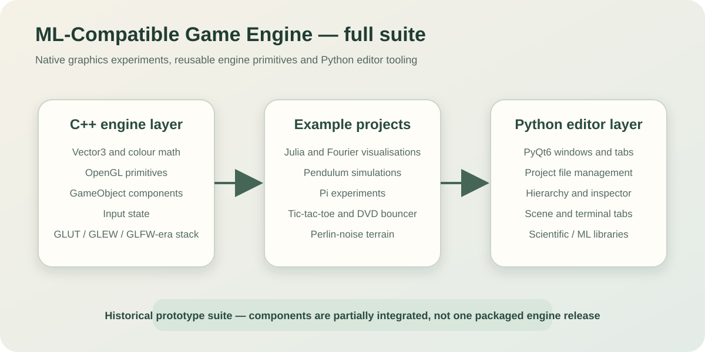
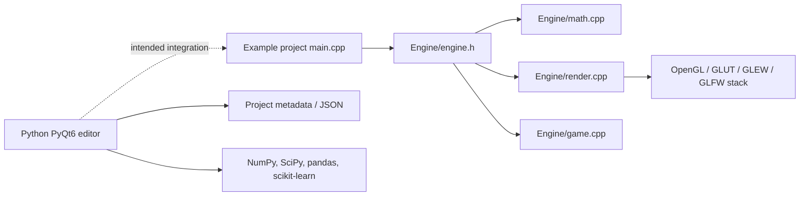

# Machine-Learning-Compatible Game Engine — Full Suite

**A historical experimental suite combining a small C++ graphics/game framework, visual simulation projects and a Python/PyQt editor prototype.**

<p align="center">
  
</p>

<p align="center">
  
  
  
  
  
</p>

## What this repository is

`full-suite` brings together several branches of the Machine-Learning-Compatible Game Engine concept:

1. **A native C++ layer** containing vector mathematics, colours, drawing primitives, input tracking and lightweight game-object components.
2. **A collection of C++ visual projects** that exercise the engine through mathematical simulations, fractals, games and graphics experiments.
3. **A Python/PyQt editor prototype** with project loading, hierarchy, inspector, scene, asset and terminal-oriented UI components.
4. **Scientific and machine-learning dependencies** intended to make Python a high-level experimentation and integration layer.

The repository should not be interpreted as a polished, versioned game-engine distribution. It is a development snapshot in which several components are useful independently but only partially integrated into one workflow.

## Main capabilities

### C++ engine layer

The public header under `Engine/engine.h` defines:

- `MathEngine::Vector3` with arithmetic, dot product and distance operations;
- `MathEngine::Color` with RGBA values and named colours;
- `RenderEngine` callbacks and primitive drawing operations;
- points, lines, rectangles, circles, fill and stroke configuration;
- `GameEngine::GameObject` with transform, rigid body, renderer and collider components;
- a keyboard input table and basic axis access.

The implementation is split across:

```text
Engine/math.cpp
Engine/render.cpp
Engine/game.cpp
Engine/engine.h
```

### Included visual projects

The `Projects/` directory contains experiments such as:

| Project | Focus |
|---|---|
| `julia` | Animated Julia-set rendering |
| `fourier` | Fourier-series visualisation |
| `pendulum` | Pendulum simulation |
| `double-pendulum` | Chaotic double-pendulum motion |
| `pi-collisions` | Collision-based π approximation experiment |
| `pi-monte-carlo` | Monte Carlo π estimation |
| `terrain-perlin-noise` | Procedural terrain/noise rendering |
| `dvd_bouncer` | Bouncing-logo graphics exercise |
| `tic-tac-toe` | Small interactive game |

Several projects contain a local `compile` script and an optional `runner.cpp` or helper source.

### Python editor layer

The `Editor/` tree contains multiple PyQt6 entry points and UI modules:

- splash and hub experiments;
- project selection and validation;
- main editor window;
- hierarchy and inspector panels;
- scene view;
- asset and terminal tabs;
- transform, vector and game-object widgets;
- JSON-oriented project metadata handling.

The main editor module supports:

```bash
python -m Editor.Editor
```

and a project-opening mode:

```bash
python -m Editor.Editor OpenProject --path /path/to/project-or-projectData.json
```

Project validation is delegated to the editor file-manager module before the full project page is opened.

## Architecture



### Runtime callback model

Example projects configure the native renderer with callbacks:

```cpp
RenderEngine::setStart([]() {
    RenderEngine::background(Color(255));
    RenderEngine::strokeWeight(10);
    RenderEngine::stroke(0);
});

RenderEngine::setUpdate(update);
RenderEngine::Enabled(true);
```

The renderer owns the application loop and invokes project-defined startup and update behaviour.

## Repository structure

```text
full-suite/
├── Engine/
│   ├── engine.h
│   ├── math.cpp
│   ├── render.cpp
│   └── game.cpp
├── Projects/
│   ├── julia/
│   ├── fourier/
│   ├── pendulum/
│   ├── double-pendulum/
│   ├── pi-collisions/
│   ├── pi-monte-carlo/
│   ├── terrain-perlin-noise/
│   ├── dvd_bouncer/
│   └── tic-tac-toe/
├── Editor/
│   ├── Editor/
│   ├── Hub/
│   ├── Splash/
│   └── FileManager/
├── requirements
├── .venv/                    # Historical committed environment snapshot
├── docs/
│   └── suite-architecture.svg
└── README.md
```

## Platform expectations

The native compile scripts are currently Linux-oriented. Their link flags target the Mesa/OpenGL and X11 ecosystem:

```text
-lGL -lGLU -lglut -ldl -lm -lglfw -lGLEW -lXi -lXmu
```

A Linux machine or WSL environment with GUI support is the most direct setup. Windows and macOS would require a proper cross-platform build system and platform-specific dependency configuration.

## Native prerequisites

On Ubuntu or Debian:

```bash
sudo apt update
sudo apt install \
  build-essential \
  freeglut3-dev \
  libglew-dev \
  libglfw3-dev \
  libglu1-mesa-dev \
  libxi-dev \
  libxmu-dev
```

The exact package names may differ across distributions.

## Run a C++ example

### 1. Clone the repository

```bash
git clone https://github.com/Machine-Learning-Compatible-Game-Engine/full-suite.git
cd full-suite
```

### 2. Compile an example

The compile scripts assume the current directory is the repository root. For the Julia-set example:

```bash
bash Projects/julia/compile
```

The script invokes:

```bash
g++ Projects/julia/main.cpp \
    Engine/render.cpp \
    Engine/math.cpp \
    Engine/game.cpp \
    -o Projects/julia/main \
    -lGL -lGLU -lglut -ldl -lm -lglfw -lGLEW -lXi -lXmu
```

### 3. Run it

```bash
./Projects/julia/main
```

Use the same pattern for another experiment:

```bash
bash Projects/double-pendulum/compile
./Projects/double-pendulum/main
```

### Development compile with warnings

The historical scripts do not enable strict warning flags. For investigation, add:

```text
-std=c++17 -Wall -Wextra -Wpedantic
```

Some source may need cleanup before compiling without warnings.

## Run the Python editor

### 1. Create a clean environment

Do not rely on the committed `.venv` directory. Virtual environments are machine-specific and should be recreated locally.

```bash
python3 -m venv .venv-local
source .venv-local/bin/activate
```

On Windows PowerShell:

```powershell
py -m venv .venv-local
.\.venv-local\Scripts\Activate.ps1
```

### 2. Install Python dependencies

The repository uses a file named `requirements` rather than the conventional `requirements.txt`:

```bash
python -m pip install --upgrade pip
python -m pip install -r requirements
```

Declared packages include:

- PyQt6 and PyOpenGL;
- NumPy, SciPy, Matplotlib and pandas;
- scikit-learn;
- Colorama and termcolor;
- pyserial.

### 3. Start the editor

From the repository root:

```bash
python -m Editor.Editor
```

Without a project path, the editor opens its no-project page.

To open a project:

```bash
python -m Editor.Editor OpenProject --path ./path/to/project
```

The path must pass the repository's project-validation logic.

## Example: Julia-set project

The Julia example demonstrates the native API by:

1. precomputing an iteration colour table;
2. installing renderer startup and update callbacks;
3. animating the complex constant over time;
4. iterating each pixel in an 800 × 800 logical field;
5. drawing points through `RenderEngine::point`.

This makes it useful as both a graphics demonstration and a stress test for the immediate-mode point renderer.

## Engine API sketch

```cpp
#include "Engine/engine.h"

void update() {
    RenderEngine::background(Color::white);
    RenderEngine::stroke(Color::blue);
    RenderEngine::line(Vector3(-0.5, 0), Vector3(0.5, 0));
}

int main() {
    RenderEngine::setStart([]() {
        RenderEngine::strokeWeight(2);
    });
    RenderEngine::setUpdate(update);
    RenderEngine::Enabled(true);
}
```

This example illustrates the intended style. Build it with the engine implementation files and required OpenGL libraries.

## Relationship between the layers

The project vision is to keep responsibilities separated:

| Layer | Primary language | Intended responsibility |
|---|---|---|
| Mathematics | C++ | Vectors, transformations and numerical primitives |
| Rendering | C++ / OpenGL | Window loop and drawing primitives |
| Game model | C++ | Game objects, components and input |
| Editor | Python / PyQt6 | Project navigation and interactive tooling |
| ML/scientific interface | Python | Experimentation with numerical and learning libraries |
| Example projects | C++ | Demonstrate and test individual engine capabilities |

The current repository contains these layers, but the editor does not yet provide a fully reliable end-to-end authoring, build and execution pipeline for every native project.

## Known limitations

- There is no canonical CMake, Meson or Make-based build system.
- Each project carries a near-duplicate shell compile command.
- Native builds are tightly coupled to Linux/X11/OpenGL package names.
- The engine is a small educational abstraction, not a complete scene graph, ECS or asset pipeline.
- Rendering, input and lifecycle behaviour require deeper API documentation and tests.
- Several classes are partial; for example, the collider component is currently only a placeholder type.
- Python and C++ components are only partially integrated.
- The editor project format is not documented as a stable public schema.
- A complete machine-learning workflow is not exposed as one runnable feature.
- A full virtual environment is committed to the repository.
- Generated executables and local environment artefacts may be present.
- There is no automated test suite or CI build matrix.
- Dependency versions are not pinned.
- The `requirements` filename is unconventional and lacks hashes or a lockfile.

## Recommended next steps

1. Remove `.venv` and generated binaries from version control, then add a comprehensive `.gitignore`.
2. Introduce one top-level CMake project with the engine as a library and examples as targets.
3. Add a versioned public API namespace and headers separated from implementation files.
4. Add unit tests for `Vector3`, colours, input and collision behaviour.
5. Document and validate a stable `projectData.json` schema.
6. Make the editor launch, build and run native examples through one explicit adapter.
7. Replace duplicated compile scripts with reusable build commands.
8. Pin Python dependencies using `pyproject.toml` and a lockfile.
9. Add screenshots or short recordings for representative examples and editor pages.
10. Define what “machine-learning-compatible” means at the API boundary: data exchange, model lifecycle, inference hooks and reproducibility.

## Project status

This repository is best used as:

- a portfolio of graphics and simulation experiments;
- a source of reusable early engine code;
- an architectural reference for the wider project;
- a migration source for a cleaner future engine repository.

It should not yet be presented as a production-ready engine SDK.

## License

No explicit licence is currently included. Unless a licence is added, the source remains under the copyright holder's default rights.
